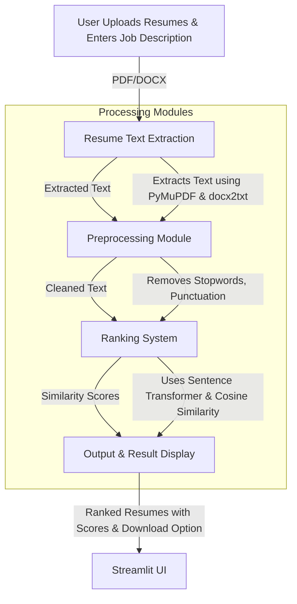

### ATS System with Ranking

Streamlit Link: ai-resume-and-screening-and-ranking-6x7zgzevml3fxbpnstmsq8.streamlit.app

# AI-Powered Resume Screening & Ranking System

## **System Architecture**

## **Component Breakdown**
### **1. User Interface (Streamlit - `main.py`)**
- Users upload resumes (PDF/DOCX) and input a job description.
- System processes and ranks resumes based on relevance.

### **2. Resume Text Extraction (`parser.py`)**
- Extracts text from PDF using **PyMuPDF**.
- Extracts text from DOCX using **docx2txt**.

### **3. Preprocessing Module (`predata.py`)**
- Cleans extracted text (removes numbers, punctuation, stopwords).

### **4. Ranking System (`rank.py`)**
- Uses **Sentence Transformers (`microsoft/mpnet-base`)** to generate text embeddings.
- Computes **cosine similarity** between job description and resumes.
- Assigns **percentage-based similarity scores**.

### **5. Output & Result Display (Streamlit UI - `main.py`)**
- Displays **ranked resumes** with similarity scores.
- Allows recruiters to **download resumes**.

## **Technology Stack**
- **Frontend:** Streamlit
- **Backend:** Python (Scikit-learn, Sentence Transformers, PyMuPDF, docx2txt, NLTK)
- **ML Model:** `microsoft/mpnet-base` for text embeddings
- **Similarity Calculation:** Cosine Similarity (Scikit-learn)